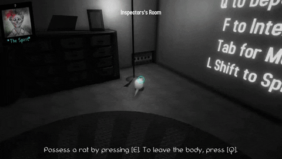

# Player & Possession

The Possesion mechanic is one of the main mechanics of the game. It allows the player to swap control to various characters (mechanic, exterminator, photographer, rats, etc.) and use their abilities to help the player solve their murder.

