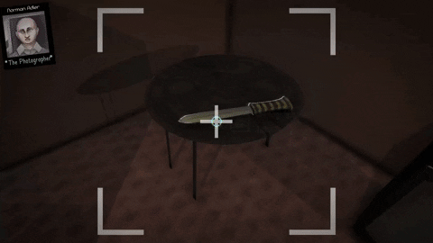

# Photography System

This system handles one of the main mechanics of the game, which is taking pictures while possessing the photographer. This feature takes and saves a screenshot within the camera's area, detects any visible clues in the picture, and then makes that accessible through the game's "Photo Library" Menu. In the Photo Library menu, the player can examine the photos to read information about all the clues that were in the picture.

 