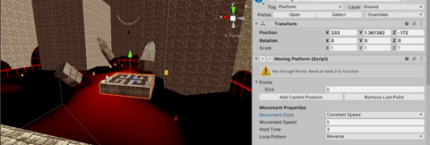
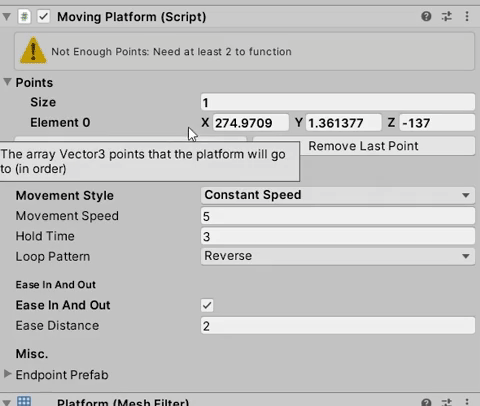

# **Moving Platforms**

Moving Platform that functions any number of destination points, with a variety of options and a custom editor for easy and quick implementation

## **Editor**
The custom editor provides a number of options to customize the movement of the moving platform
- Movement Style: Allows the platform to move at either a Constant Time or Constant Speed
	- Constant Time: Can designate the exact time (in seconds) the platform should take to go from one point to another. Speed may vary if distances between points vary
	- Constant Speed: Can set the speed of the platform and it will move at that speed consistently regardless of distance. Time will vary
- Hold Time: The time that the platform will wait at a point before moving again
- Loop Pattern: Determines how the platform will continue after reaching the last point in the sequence
	- Reverse: Will go back through the points the way it came back to the original starting point
	- Cycle: Will go from the last point back to the first point
- Ease in and out: Determines whether the platform will slowly accelerate/deccelerate when reaching/leaving points
- Ease in and out Distance: Determines how close to points that easing in and out will take place
