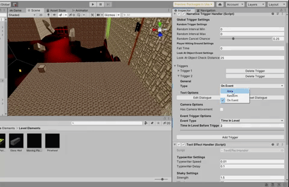

# **Narrative Trigger Handler**

A system that allows for the creation of different types of triggers in scenes that activate under certain 
conditions and plays appropriate text and audio for narrative purposes. Text Generation and rules are handled through the [Dialogue Builder](https://github.com/zseiple/code-samples/tree/main/Neon%20Oblivion/Narrative%20Trigger%20System/Dialogue%20Builder)

There are 3 distinct types of triggers:
- **Area**: Activates when an object with a specified tag enters a specified area

- **Random**: Activates at a random time during a random interval
- **Event**: Activates on the occurrance of a given event
	- Player Death
	- Looking at a specific object
	- After the player has been in a level for a specified amount of time
	- After a level has been completed
	